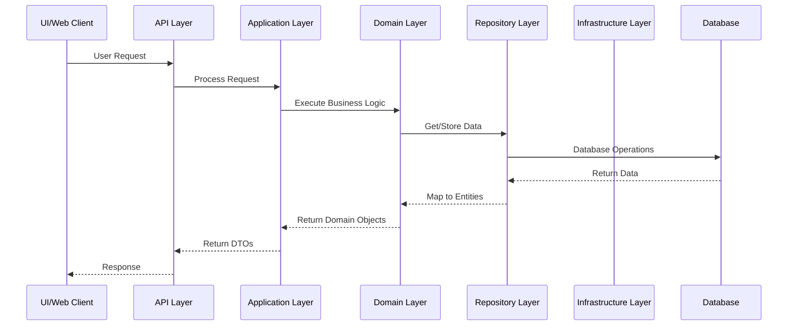
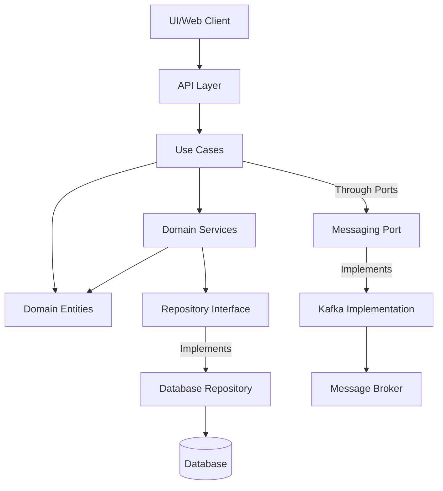

# Clean Architecture Flow Diagram

Below is a flowchart that visualizes the Clean Architecture implementation in this project:



## Alternative Representation - Component Diagram



## Clean Architecture Layers - Dependency Flow

```mermaid
layerDiagram
    "Domain Layer" {
        string Entities
        string ValueObjects
        string DomainEvents
        string DomainInterfaces
    }

    "Application Layer" {
        string UseCases
        string Ports
        string DTOs
        string AppServices
    }

    "Interface Adapters" {
        string APILayer
        string ServiceLayer
        string RepositoryLayer
    }

    "Infrastructure Layer" {
        string DBConnections
        string MessageQueue
        string ExternalClients
        string WebSockets
    }

    "Infrastructure Layer" ||--o{ "Interface Adapters" : implements
    "Interface Adapters" ||--o{ "Application Layer" : uses
    "Application Layer" ||--o{ "Domain Layer" : depends_on
```

## Key Flow Interactions

1. **Request Flow**:

    - External request enters through API or WebSocket
    - Passes through Middleware for processing
    - Routes to appropriate API Handler
    - API Handler translates to Use Case or Domain call
    - Business logic executed in Domain layer
    - Results returned through the same path outward

2. **Data Flow**:

    - Domain defines data structures as Entities and Value Objects
    - Repositories translate between Domain Entities and Database
    - DTOs handle data transformation between layers
    - Data flows to external systems through Infrastructure adapters

3. **Dependency Direction**:

    - All dependencies point inward toward Domain layer
    - Domain has no knowledge of outer layers
    - Interfaces (Ports) enable outside communication
    - Implementations (Adapters) fulfill interface contracts

4. **Cross-Service Communication**:
    - Services communicate through Domain Events
    - Kafka provides asynchronous messaging
    - WebSockets enable real-time notifications
    - Domain Events remain pure and system-agnostic

The architecture ensures separation of concerns while maintaining flexibility to change external systems without affecting core business logic.
